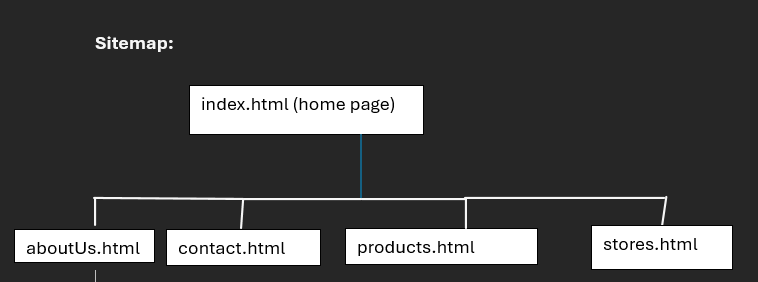

# Steepd - Artisanal Tea Shop Website

## Student Information
- **Name:** Marcus Johnson
- **Student Number:** ST10496028 
- **Course:** WEDE5020
- **Institution:** IIE RoseBank College

## Project Overview
This project involves the design and development of a fully functional website
for **Steepd**, a hypothetical artisanal tea shop. The website serves as both an
online store and a promotional platform for a hypothetical physical store location. The goal
is to create a user-friendly and aesthetically pleasing site that showcases the brand's premium products.

## Website Goals and Objectives
The primary goals of the Steepd website are:
- To establish a strong online presence for the Steepd brand.
- To facilitate online sales of artisanal teas through an integrated product page.
- To educate visitors on the history, origin, and preparation methods of different teas.
- To increase foot traffic to the physical store location.
- To fill a market niche for specialized, high-quality teas.

**Key Performance Indicators:**
- Number of online orders placed.
- Number of contact form enquiries submitted.
- Increase in in-store sales tracked via online-promoted offers.

## Key Features and Functionality
- **Home Page (`index.html`):** Hero section, value proposition, product teasers, and calls to action.
- **About Us Page (`about.html`):** Company history, mission, values, and team profiles.
- **Our Products Page (`products.html`):** Display of available teas with images, descriptions, prices, and non-functional "Add to Cart" buttons.
- **Tea Information Page (`guide.html`):** Educational content on tea types and brewing guides.
- **Contact Us Page (`contact.html`):** Contact information presented in a list and a contact form.
- **Store Locator Page (`locations.html`):** Embedded Google Map showing the store location and business hours.

## Sitemap

## Timeline and Milestones
- **Week 1:** Project planning, wireframing, and framework finalization.
- **Week 2:** HTML structure and content implementation for all pages.
- **Week 3:** styling and layout with CSS.
- **Week 4:** Implementation of basic JavaScript framework interactivity.
- **Week 5:** Final testing and start hosting

## Wireframes

\wireframe1.png)
\wireframe2.png)
\wireframe3.png)
\wireframe4.png)
\wireframe5.png)
(the above images were generated using Figma AI and modified by me)

## References
### Images
Klet, D. (2025) *Assortment of herbal tea ingredients including flowers and dried fruit*. [Photograph] Pexels. Available at: https://www.pexels.com/photo/assortment-of-herbal-tea-ingredients-including-flowers-and-dried-fruit-25600467/ (Accessed: 25 February 2025).

Osmachko (2025) *Overhead view of loose-leaf green tea in a bowl*. [Photograph] Pexels. Available at: https://www.pexels.com/photo/green-tea-in-clear-drinking-glass-230477/ (Accessed: 25 February 2025).

Valeriya (2025) *Steaming cup of black tea on a wooden table*. [Photograph] Pexels. Available at: https://www.pexels.com/photo/tea-cup-and-teapot-on-wooden-table-11213963/ (Accessed: 25 February 2025).